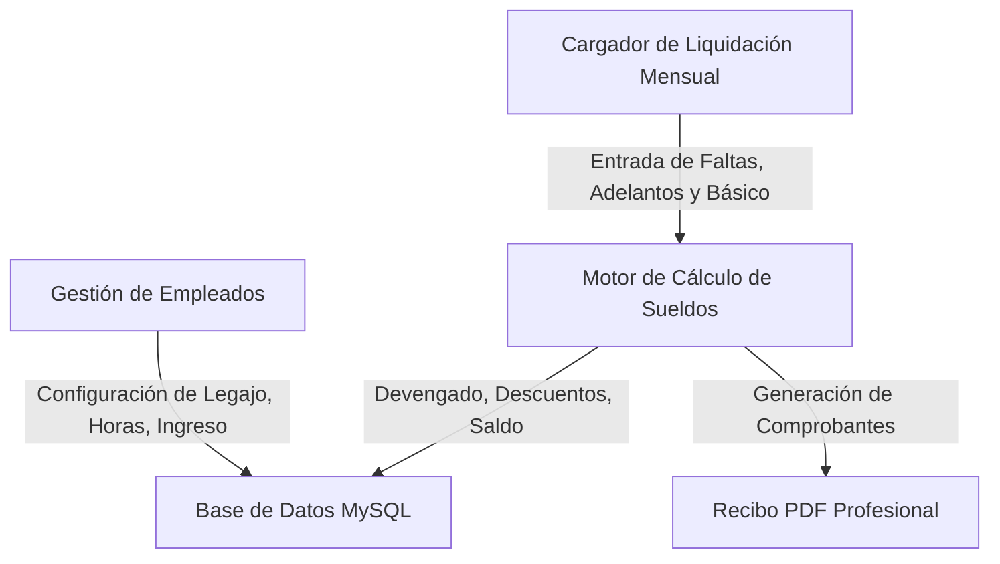

# Plan de Sistema Web de Liquidación de Sueldos y Recibos PDF

Analizamos la planilla **`RETRI 26.xlsx`** de la contadora y abstrajimos la lógica matemática y de negocio exacta para los 18 empleados.

---

## 📐 Análisis de Fórmulas y Reglas Halladas en el Excel

1. **Jornada de Trabajo Proporcional**:
   - **Jornada base**: 8 horas diarias = 100% del Sueldo Básico ($889.390 en la escala actual).
   - **Jornada reducida**: Empleados de 6 hs (75%), 4 hs (50%) o 3 hs (37.5%). El básico y conceptos se escalan proporcionalmente a sus horas diarias (`Horas / 8`).

2. **Antigüedad**:
   - **1% del Básico por cada año de antigüedad** (`Básico * Años * 0.01`).

3. **Presentismo y Faltas**:
   - **Presentismo (8.33%)**: Calculado sobre `(Básico + Antigüedad) * 8.33%`.
   - **Pérdida de Presentismo**: Si el empleado tiene faltas no justificadas en el mes, **el presentismo pasa a $0 (se pierde el 100%)**.
   - **Descuento de Días (Base 30 días)**: Todos se calculan sobre 30 días mensuales. Si falta $F$ días, cobra por `(30 - F) / 30`.

4. **Sin Aportes ni Retenciones de Ley**:
   - **Confirmado por el usuario**: El recibo PDF **no incluye** Jubilación (11%), Obra Social (3%), Ley 19032 (3%) ni cuotas sindicales, ya que no se realizan aportes. Mostramos los conceptos brutos devengados reales.

5. **Adelantos de Quincena y Liquidación de Fin de Mes**:
   - **Recibo Único Mensual**: Se emite a fin de mes.
   - **Desglose de Anticipos**: Se registran los pagos parciales realizados en la 1.ª y 2.ª quincena (Adelanto 1, Adelanto 2, vales).
   - **Saldo Neto Final**: `Total Devengado - Suma de Adelantos = Saldo a Cobrar`.

---

## 🛠️ Arquitectura Propuesta del Sistema Web

Construiremos un sistema web receptivo, moderno y fácil de usar en PHP 8.2 + MySQL (para XAMPP local) con panel web interactivo y motor de generación de PDF descarga/impresión directa.

### Componentes Principales:
1. **Módulo de Empleados**:
   - Nombre, Fecha de Ingreso (calcula antigüedad automáticamente), Horas diarias (8, 6, 4, 3, etc.), Estado.
2. **Módulo de Liquidación Quincenal / Mensual**:
   - Selección del Período (Mes/Año).
   - Carga ágil de: Básico del mes, Días Faltados y Adelantos dados en la 1ª y 2ª quincena.
   - Cálculo automático instantáneo de:
     - Antigüedad ($)
     - Presentismo ($ / $0 si hay falta)
     - Proporcional de Horas
     - Total Devengado
     - Total Adelantos
     - Saldo a Cobrar a Fin de Mes
3. **Generador de Recibos PDF en 1 Clic**:
   - Plantilla estética y formal de comprobante de pago mensual.
   - Muestra: Período, Datos del Empleado, Desglose de Días Trabajados (30 - Faltas), Haberes (Básico, Antigüedad, Presentismo, No Remunerativo), Adelantos de Quincena y **Saldo Final a Cobrar**.
   - Descarga individual o descarga masiva de los 18 recibos en PDF.

---

## ❓ Preguntas Abiertas / Confirmación para el Usuario

> [!IMPORTANT]
> **1. Formato y Entrega del Recibo PDF**  
> ¿Prefieres que los PDFs de cada empleado se generen individualmente (un botón para descargar/imprimir el PDF de cada empleado) o también una opción para "Descargar todos los PDFs del mes en un solo archivo PDF para imprimir juntos"?

> [!NOTE]
> **2. Monto Básico de Referencia**  
> En la planilla actual el básico general de 8 hs es de **$889.390**. ¿Este monto cambia todos los meses por paritarias o aumentos? El sistema incluirá un campo para actualizar la escala del básico cuando suba.

---

## 🧪 Plan de Verificación

1. **Validación Numérica Contra el Excel**:
   - Comprobaremos que los 18 empleados de la planilla de Febrero 2026 devuelvan **el 100% de coincidencia exacta** (centavo a centavo) con las columnas `NETO MAS SAC`, `ANTICIPOS` y `SDO A COBRAR` del Excel `RETRI 26.xlsx`.
2. **Pruebas de PDF**:
   - Generación de comprobantes de prueba para empleados de 8hs, 4hs y 3hs, verificando estética limpia sin aportes jubilatorios.
